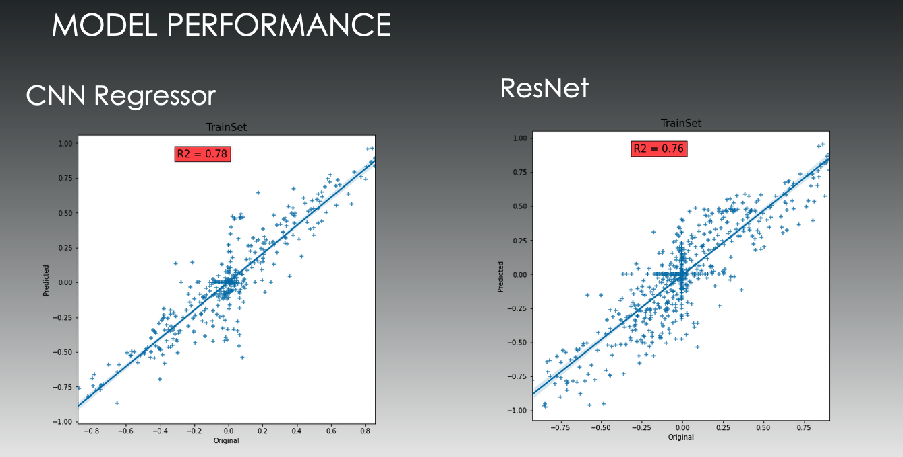
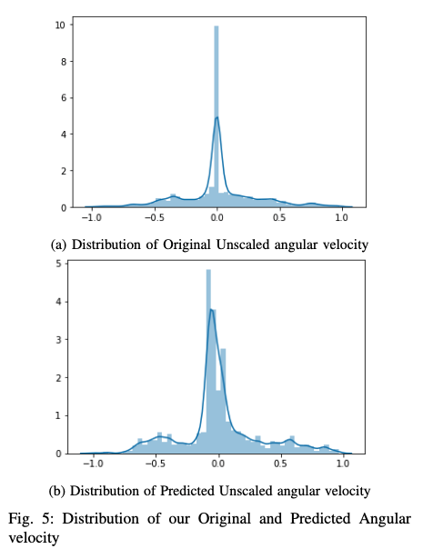
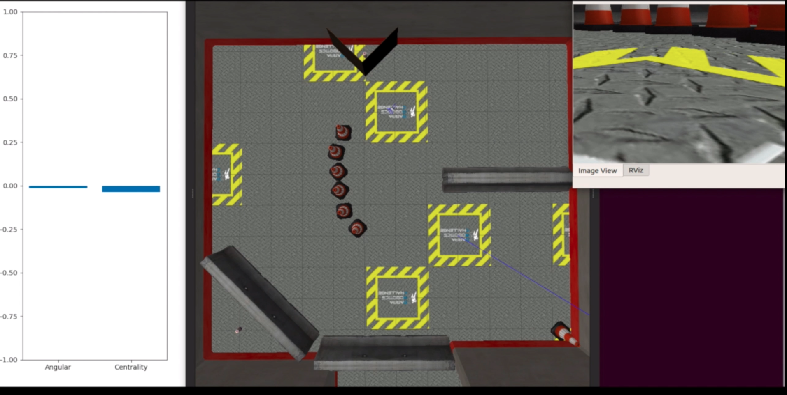
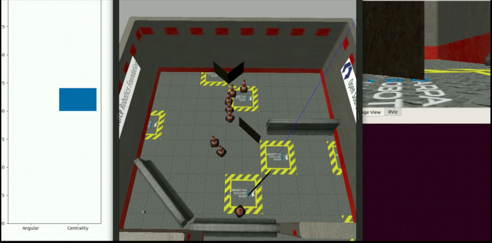
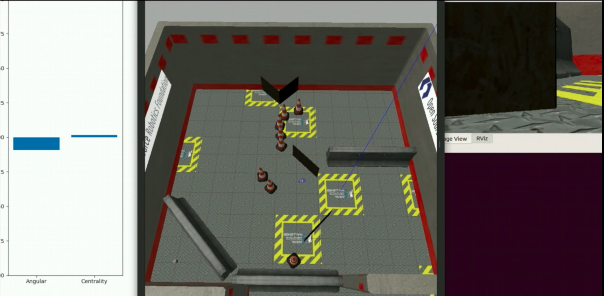

# Learning to Drive by Crashing
Thymio is an open-source educational robot designed by researchers from the EPFL, in collaboration with ECAL. We used the gazebo 3D simulator. The thymio robot has 5 sensor, i.e. left, center-left, center, center-right, right.
### Problem statement
Teach a robot to drive while avoiding obstacles using only it's camera.
### Method
The above problem statement drills down to predicting the required angular velocity for the Thymio Robot. There is also a subroutine to rotate the robot inplace to avoid orthogonal obstacles. We used the proximity sensor information at the time of training to generate true angular velocity outputs using the formula.

```
angular_velocity = np.dot(sensor_values, [1,2,0,-2,-1])
```
The above formula only works in non symetric cases, i.e. when the robot is approaching an obstacle at an oblique angle. To accomodate for this, we also predict centrality.
```
centrality = np.dot(sensor_values, [-1,-1,4,-1,-1])
```
##### Data collection
10k images of 100x100x3 size were collected in the test environment with different frequencies near and away from the object to take into account the problem of class imbalance.

##### Models
2 3-layered CNN models were trained on the 10k images (split into train and validation). One model predicted the angular velocity while the other predicted the centrality to the obstacle.
The model was tested in a different environment to report the number of collision and the total distance traveled, computer over a 10 min window.
The model was compared with a backbone resnet-18 model for benchmarking.
The final test for the model was to run in a testing arena with plethora of obstacles requiring complex maneuvers.

### Resuls
CNN Regressor performed better in the training environment but the Resnet model was able to genralize better in the testing arena. The same trend was observed on number of collisions aswell where the CNN-Regressor had 1.4 collisions/min whereas the Resnet model had 1.2, computed on the testing arena.



### Demo images



